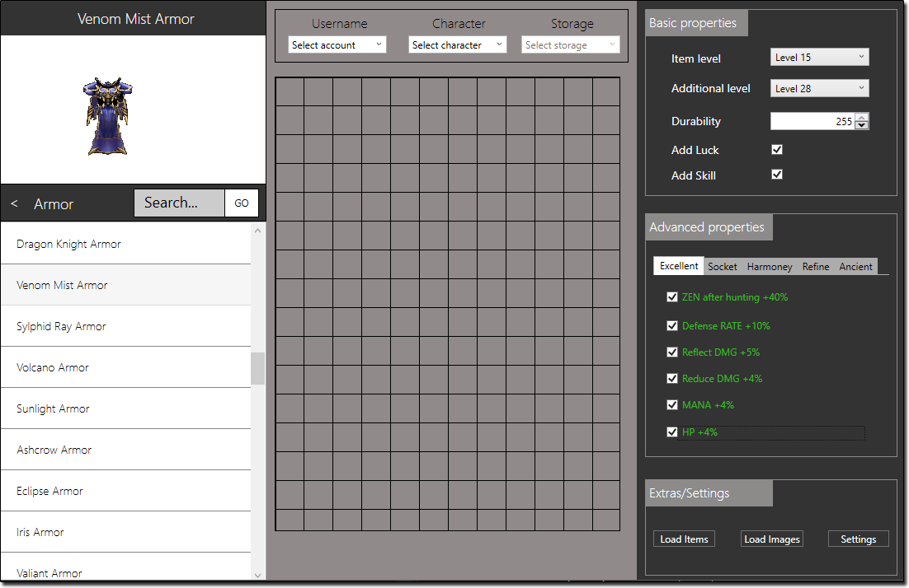

# MU Database Helper



[](https://forthebadge.com)

MU DB Helper is a database editing tool for MuOnline Ex702+  
The tool allows users to create, edit and remove items in a characters storage  
Items can be highly customizable where the tool offers a wide range modification options

## Features
- Add, edit, remove items
- Character & extra inventory storage
- Vault storage
- Personal shop storage
- Feautres all ex702 - S8EP2 items
- Populate item database from MUOnline server `Item.txt`
- All classic base MU Online item options i.e. ilvl, dur, luck, skill etc.
- Excellent, socket, harmony and refine options
- Ancient set items

## Prerequisites
- Visual Studio 2013
- SQL Server 2008+
- ODBC Driver 13
- MU Online Ex702+ DB

## Installation
- Clone the repository
```
git clone https://github.com/kyleruss/mu-db-helper.git
```
- Ensure you have a `MuOnline` database, create one if not
```
CREATE DATABASE MuOnline;
```

- Run each of the table creation scripts in the `SQL/tables` directory
- Run each of the insertion scripts in the `SQL/insertion` directory
- Run the item initialization stored procedure in `SQL/InitItemsProcedure`
- Import the project solution `MuDBHelper.sln` into Visual Studio

## License
MU DB Helper is available under the MIT License  
See [LICENSE](LICENSE) for more details
